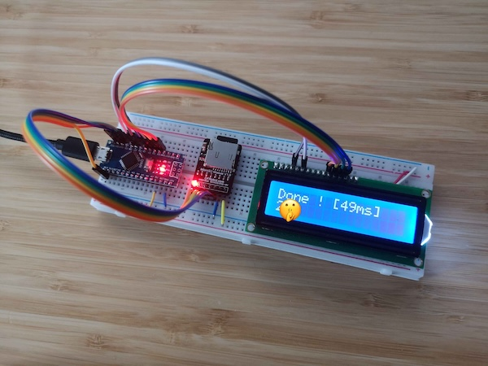

# Day 1, Part 1

Let's warm up with [day one](https://adventofcode.com/2015/day/1).

Nothing fancy here, it's just a matter of reading the input file and incrementing/decrementing a counter.

My first version read the SD card character by character, but the file access were very slow, so I switched to reading chunks of 100 characters at a time. The buffer size is arbitrary and I could probably get better results if I tried to tweak this value.

Note : The Arduino Nano board is pretty limited in regards to RAM, so any value above 1000 crashed the program.

I could not find a way to link to libraries outside of the working folder in the Arduino IDE, so I guess all relevant files will get copied every day. I can live with that.

Runtime : 49ms

[Next : Day 1 - Part 2](../day_01_part_2)
